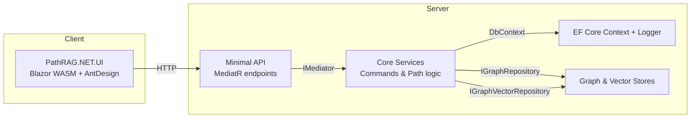
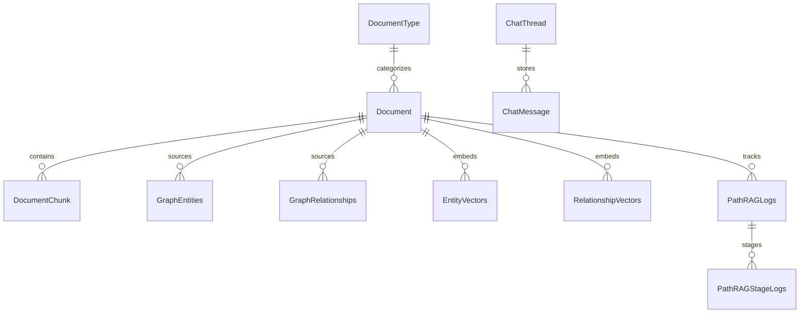
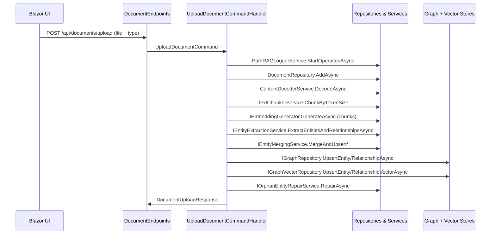
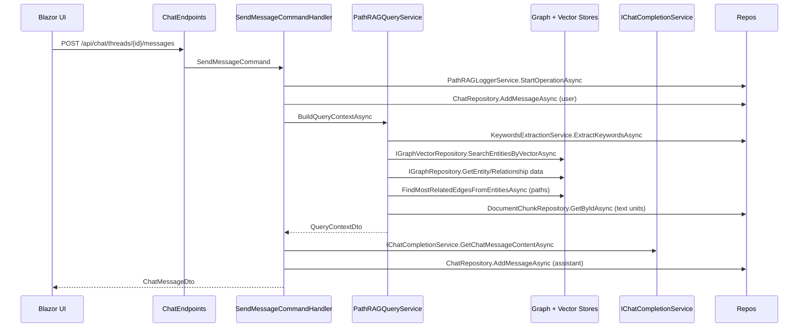

# PathRAG Architecture & Implementation Guide

This guide connects the PathRAG research blueprint to its .NET realization inside this repository. It is organized for engineers who need to understand the theory, the software architecture, and the extension points without diving into every source file.

---

## 1. Research Background

- **Paper.** [PathRAG: Pruning Graph-Based Retrieval Augmented Generation with Relational Paths](https://arxiv.org/html/2502.14902v2)
- **Authors.** Boyu Chen¹, Zirui Guo², Zidan Yang¹, Yuluo Chen¹, Junze Chen¹, Zhenghao Liu³, Chuan Shi¹, Cheng Yang¹.
- **Core idea.** Replace flat neighbor dumps with a lightweight graph pipeline that surfaces only the most reliable relational paths, then order those paths by reliability inside the prompt to avoid “lost in the middle” effects.
- **Stages.**
  1. **Node Retrieval** – keywords to seed relevant graph regions.
  2. **Path Retrieval** – flow-based pruning that keeps the most informative multi-hop chains.
  3. **Answer Generation** – prompt the LLM with path narratives sorted by reliability.
- **Why it matters.** Less redundant context, better global reasoning on graph-shaped knowledge, and lower token spend compared with GraphRAG/LightRAG baselines.

---

## 2. Solution Architecture

- **UI (`PathRAG.NET.UI`).** Blazor WebAssembly shell with AntDesign components. `IChatService` and `IDocumentService` wrap the REST API and convert responses to Markdown for rendering.
- **API (`PathRAG.NET.API`).** Minimal APIs register MediatR, EF Core, graph/vector repositories, and Scalar documentation. `Program.cs` also triggers EF migrations plus graph/vector table initialization at startup.
- **Core (`PathRAG.NET.Core`).**
  - `UploadDocumentCommand` orchestrates ingestion and graph updates.
  - `SendMessageCommand` drives chat interactions and delegates to `PathRAGQueryService`.
  - `PathRAGQueryService` implements the PathRAG retrieval stages (keyword extraction, node/vector search, path pruning, prompt assembly).
  - `PathRAGLoggerService` records every stage in the logging tables for observability.
- **Data (`PathRAG.NET.Data`).** EF Core `PathRAGDbContext` maintains relational tables for documents, chunks, document types, chat threads/messages, and the logging entities.
- **Graph & Vector (`PathRAG.NET.Data.Graph.*`).**
  - `IGraphRepository` abstracts node/edge CRUD plus traversal.
  - `IGraphVectorRepository` abstracts semantic search over entity and relationship embeddings.
  - `SqlServerGraphRepository` and `SqlServerGraphVectorRepository` implement those contracts using SQL Server graph tables and vector data types (see [SQL Graph Architecture](https://learn.microsoft.com/en-us/sql/relational-databases/graphs/sql-graph-architecture?view=sql-server-ver17) and [SQL Vector Data Type](https://learn.microsoft.com/en-us/sql/t-sql/data-types/vector-data-type?view=sql-server-ver17&tabs=csharp)).

---

## 3. Data Model, Document Categories, and Search Scope

- **Document categories.**
  - `DocumentType` captures a hierarchical taxonomy (General → HR → Policies → Leave/Travel/Benefits). Default seeds guarantee at least one general-purpose bucket.
  - Each uploaded `Document` references a `DocumentType`, and the UI lets users scope uploads and queries by selecting one or more categories.
  - `QueryParamDto.DocumentTypeIds` flows from the Blazor UI to the API, and `PathRAGQueryService.ResolveDocumentIdsAsync` converts those categories into specific document IDs. Both `IGraphVectorRepository.Search*` methods and `IGraphRepository.Get*` methods accept the filtered ID set, so users can focus on HR policies without surfacing finance documents, or vice versa.
  - The same filtering applies during ingestion cleanup: deleting a document automatically removes its chunks, graph rows, and vectors without touching other categories.
- **Relational storage.**
  - `DocumentChunks` stores chunk text plus embeddings (`vector(1536)`). `ChatThreads`, `ChatMessages`, and the logging tables provide traceability.
- **Graph storage.**
  - `GraphEntities` and `GraphRelationships` are SQL Server node/edge tables populated via Dapper. Each row preserves `SourceId`, a `<SEP>`-delimited list of chunk GUIDs, so the system can backtrack from a graph fact to the originating text unit.
- **Vector storage.**
  - `EntityVectors` and `RelationshipVectors` keep embeddings for semantic search. They mirror the Python reference architecture’s `entities_vdb` and `relationships_vdb`, allowing independent tuning of node vs. edge retrieval.

---

## 4. Document Upload Flow (Classes & Method Collaboration)

1. **Entry point.** `DocumentEndpoints.UploadDocument` streams the uploaded file into `UploadDocumentCommand`.
2. **Logging & metadata.** `PathRAGLoggerService.StartOperationAsync` creates an operation log; each subsequent stage logs via `StartStageAsync`/`CompleteStageAsync`.
3. **Content processing.**
   - `ContentDecoderService.DecodeAsync` supports PDF, DOCX, and text formats.
   - `TextChunkerService.ChunkByTokenSize` ensures chunk overlap and token bounds defined in `PathRAGSettings`.
4. **Chunk embeddings & storage.** `IEmbeddingGenerator` (Semantic Kernel) produces vector batches that `DocumentChunkRepository.AddRangeAsync` persists.
5. **Entity & relationship extraction.**
   - `IEntityExtractionService.ExtractEntitiesAndRelationshipsAsync` (LLM-based) runs against each chunk.
   - `IEntityMergingService.MergeAndUpsertEntityAsync` and `MergeAndUpsertRelationshipAsync` deduplicate variants before persisting.
6. **Graph persistence.**
   - Nodes/edges go through `IGraphRepository.Upsert*` ensuring SQL graph tables stay consistent per document.
   - `IOrphanEntityRepairService.RepairAsync` checks for edges pointing to missing entities and re-runs extraction if required.
7. **Vector persistence.**
   - `IEmbeddingGenerator.GenerateAsync` runs again for the final entity/relationship text and feeds `IGraphVectorRepository.UpsertEntityVectorAsync` / `UpsertRelationshipVectorAsync`.
8. **Completion.** Document status flips to `completed` (or `failed` if any stage throws), and the logger closes the operation. The response returns the document ID plus a summary, ready for UI refresh.

Result: Every chunk, entity, relationship, and vector is tagged with the originating document and its category so later queries can filter precisely.

---

## 5. Chat & Query Flow (Classes & Method Collaboration)

1. **User message persistence.** `SendMessageCommand` records the user utterance through `IChatRepository`, guaranteeing chat history continuity.
2. **Context building.**
   - `PathRAGQueryService.BuildQueryContextAsync` orchestrates all retrieval steps while sharing the external `logId` for stage-level telemetry.
   - `IKeywordsExtractionService` outputs high-level (global) and low-level (local) keyword sets.
   - `IGraphVectorRepository.SearchEntitiesByVectorAsync` and `SearchRelationshipsByVectorAsync` filter on the document IDs tied to the selected categories, ensuring the context reflects the user’s chosen scope.
   - `GetNodeDataAsync` brings back nodes, degrees, and related text units.
   - `FindMostRelatedEdgesFromEntitiesAsync` reconstructs candidate paths, feeds them through a BFS-style resource propagation algorithm, and returns natural-language descriptions sorted by reliability.
   - `FindRelatedTextUnitsFromRelationshipsAsync` maps graph facts back to the originating chunks via the `<SEP>` encoded `SourceId` field.
   - CSV builders format high-level entities, high-level relationships, low-level entities, low-level relationships, and sources exactly as expected by PathRAG prompts.
3. **Prompt creation.** `SendMessageCommand` calls `BuildSystemPrompt`, which injects the CSV blocks into sections labelled “High-Level Entities”, “High-Level Relationships”, “Specific Entities”, “Specific Relationships”, and “Source Documents”.
4. **LLM response.** `IChatCompletionService` (e.g., Azure OpenAI, GPT-4o, or DeepSeek) generates the answer; `ChatRepository` stores it and the logger closes the operation.
5. **UI update.** The Blazor UI fetches the enriched chat transcript, converts Markdown to HTML, and presents it alongside the thread list.

Because every repository call receives the filtered document ID set, a policy question will stay inside policy documents, whereas budgeting queries can target finance documents, improving answer precision and legal compliance.

---

## 6. Benefits of the PathRAG-Inspired Design

| Benefit | Effect in Practice | Supporting Implementation |
|---------|-------------------|---------------------------|
| **Reduced redundancy & token cost** | Prompts only include reliability-ranked paths plus capped text units, keeping context concise. | `PathRAGQueryService.TruncateByTokenSize` enforces token budgets at each stage; path pruning favors top-scoring chains. |
| **Global reasoning** | Multi-hop relational narratives let the LLM answer questions that span multiple entities. | `FindMostRelatedEdgesFromEntitiesAsync` reconstructs 1–3 hop paths and describes them in natural language. |
| **Prompt robustness** | Ordering by reliability places the most important information at the prompt tail, addressing “lost in the middle”. | `PathRAGQueryService.FormatQueryContext` appends high-reliability paths last, matching the paper’s prompt template. |
| **Observability** | Every ingestion/query stage is timestamped and stored, simplifying troubleshooting and cost tracking. | `PathRAGLoggerService` populates `PathRAGLogs`, `PathRAGStages`, and `PathRAGStageLogs`. |
| **Fine-grained scope control** | Users restrict both ingestion and retrieval by category, preventing cross-domain leakage. | Document type selection flows through `QueryParamDto`, `ResolveDocumentIdsAsync`, and repository filters. |
| **Extensibility** | New graph/vector providers or LLMs can be swapped without rewriting the pipeline. | `IGraphRepository`, `IGraphVectorRepository`, `IChatCompletionService`, and `IEmbeddingGenerator` are injected interfaces. |

---

## 7. Extensibility Checklist

1. **Alternative graph/vector stores.** Implement the repository interfaces for Neo4j, Cosmos DB, PGVector, or Elasticsearch, then register them in `Program.cs`. The rest of the solution only depends on the abstractions.
2. **LLM experimentation.** Swap out the Semantic Kernel-backed services to compare GPT-4o, DeepSeek, or on-prem models. Keyword extraction and embedding generators follow the same pattern.
3. **Prompt innovation.** `PathRAGQueryService.FormatQueryContext` is a single method; adjusting CSV schemas or adding new sections (e.g., citations, metadata tags) is straightforward.
4. **Telemetry.** The Blazor UI can surface `PathRAGLogs` and `PathRAGStageLogs` to show ingestion throughput, failure rates, or cost per stage.

---

## 8. Library Inventory

| Layer | Key Packages | Purpose |
|-------|--------------|---------|
| UI | AntDesign, AntDesign.ProLayout, AntDesign.Charts, Markdig, Blazor WebAssembly | Rich component library, layout, charting, Markdown rendering, and WASM hosting. |
| API | MediatR, FluentValidation, Scalar.AspNetCore, MinimalHelpers | Minimal API routing, request validation, API reference UI, helper analyzers. |
| Core | AutoMapper, Microsoft.SemanticKernel, Microsoft.ML.Tokenizers, DocumentFormat.OpenXml, PdfPig | DTO mapping, LLM orchestration, token heuristics, document decoding. |
| Data | EF Core SQL Server, EFCore.SqlServer.VectorSearch, Dapper, EntityFrameworkCore.Exceptions | Relational persistence, vector column support, lightweight SQL, resilient error handling. |
| Graph | Dapper, Microsoft.Data.SqlClient | SQL Server graph and vector operations through Dapper. |
| Shared Models | AutoMapper | Reusable mappings between entities and DTOs. |

---

## 9. Suggested Next Steps

1. **Backend experiments.** Prototype a Neo4j or PostgreSQL PGVector adapter to validate the repository abstraction.
2. **LLM benchmarking.** Run comparative evaluations across GPT-4o, DeepSeek, and open-weight models using identical prompts to quantify gains or cost savings.
3. **Operations dashboard.** Build a Blazor page that surfaces ingestion/query logs, grouped by document type, to highlight hot spots and latency outliers.

---

## Author

Robert Dennyson, Solution Architect, UK  
Contact: robertdennyson@live.in
